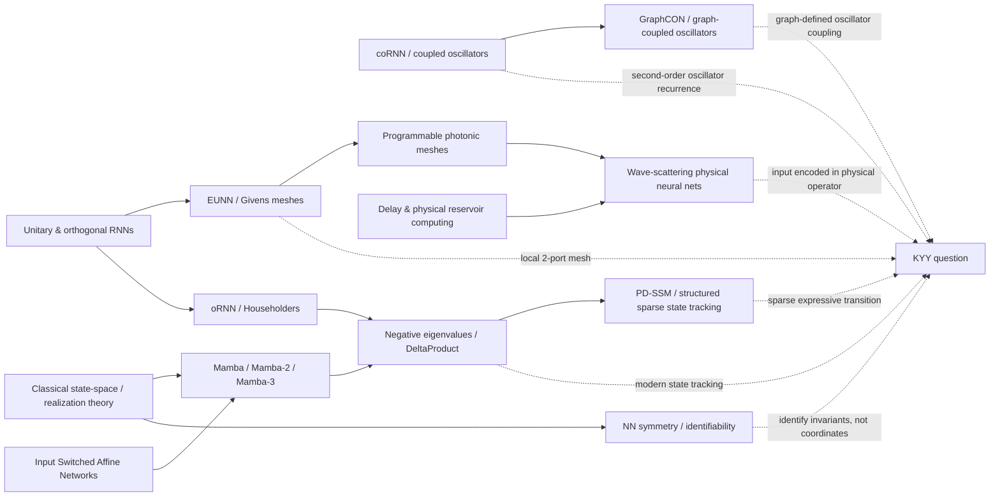

# KYY / map

This folder is the **research cartography layer** for KYY.

We got here after repeatedly deriving something that felt new and only afterwards discovering that the destination already had a name: realization/gauge theory, balanced truncation, Givens meshes/EUNN, Householder RNNs, coupled-oscillator RNNs, and so on.

That is not a reason to stop. It is a reason to change the loop.

> **Search first. Locate the nearest known object. Compute the residual. Build only the residual.**

The goal of `map/` is therefore not to prove novelty. It is to keep a live map of the known mathematical/architectural landscape around the Geometric Neuron / KYY idea and to identify small valleys that remain worth testing.

Snapshot date: **2026-08-10**.

## What is being mapped

KYY began from a simple proposition:

> Can a recurrent computation be generated by a **local geometry + propagation** rather than by unrestricted global state mixing?

That sentence intersects several mature fields. The useful way to navigate them is with multiple axes rather than one family tree.

### Axis A — transition algebra

```text
scalar/positive diagonal
        |
 signed / complex diagonal
        |
 diagonal + low rank
        |
 permutation-diagonal / structured sparse
        |
 products of Householders / Givens
        |
 general sparse matrix
        |
 dense matrix
```

### Axis B — communication support

```text
independent channels
      -> fixed small blocks
      -> nearest-neighbour / graph-local
      -> sparse long-range
      -> global reduction/broadcast
      -> dense all-to-all
```

### Axis C — where the operator comes from

```text
fixed hand-designed
      -> freely learned
      -> input-switched / token-conditioned
      -> low-dimensional control of a tied structure
      -> geometry / physical parameters generate operator
      -> literal physical substrate
```

### Axis D — dynamical semantics

```text
leaky memory
  -> signed counting
  -> complex/rotary state
  -> noncommutative state tracking
  -> second-order oscillation / waves
  -> scattering / resonant physical dynamics
```

### Axis E — what can be identified

```text
checkpoint coordinates
      -> symmetry / gauge orbit
      -> invariant subspace
      -> minimal realization
      -> input/output equivalence class
```

The Geometric Neuron intuition is not a single point on these axes. It is the conjunction:

```text
LOCAL GEOMETRY
      +
PROPAGATION / MODES
      +
SMALL NUMBER OF CONTROLS
      +
LOCAL READOUTS
      +
INPUT/OUTPUT TESTABLE BEHAVIOUR
```

The map asks which parts are already occupied and which conjunctions are still not obviously represented in the literature.

## Map legend

We use four labels.

- **OCCUPIED** — a paper is an exact or very close match to the proposed mechanism.
- **NEIGHBOUR** — a major ingredient is established, but an important axis differs.
- **BRIDGE** — the two sides exist separately; a specific conjunction was not located in the search so far.
- **UNMAPPED** — targeted search did not find the exact object. This is **not** a novelty claim.

The rule is deliberately conservative: `UNMAPPED != NEW`.

## Bird's-eye map



The diagram is intentionally uncomfortable: **KYY is surrounded**. That is good. It tells us exactly what must be subtracted before anything is called ours.

## The strongest prior-art hits so far

### 1. Local two-port scatter mesh -> EUNN / Givens meshes — OCCUPIED

Jing et al. (ICML 2017), *Tunable Efficient Unitary Neural Networks*, build a unitary recurrent transition from alternating layers of local 2x2 transformations. Mesh depth is a tunable capacity parameter, up to full unitary expressivity.

This is the nearest known object to KYY's first `geom_scatter` implementation.

KYY residual: our current code makes the local operators token-selective and evaluates modern finite-state tracking. That exact conjunction needs a dedicated search; it is not enough to call the architecture new.

### 2. Global reflector control -> oRNN / DeltaProduct — OCCUPIED

Mhammedi et al. (ICML 2017) use products of Householder reflections to parameterize orthogonal RNN transitions. DeltaProduct (2025) brings generalized Householder products directly into the modern linear-RNN/state-tracking setting.

So `householder2` is a baseline, not a KYY contribution.

### 3. Second-order oscillator RNN -> coRNN — OCCUPIED

Rusch & Mishra (2020) proposed a recurrent network from a discretized system of controlled nonlinear second-order oscillators, explicitly motivated by coupled biological oscillators and long-term dependencies.

This is a close ancestor of KYY's first `geom_wave` instinct.

### 4. Graph-defined coupled oscillators -> GraphCON — OCCUPIED/NEIGHBOUR

GraphCON (Rusch et al., 2022) uses second-order controlled/damped oscillators coupled by a graph adjacency structure. Its target is graph representation learning rather than autoregressive sequence-state tracking, but the statement "geometry determines oscillator coupling" is not ours by itself.

### 5. Input-dependent recurrent operator -> ISAN / modern selective SSMs — OCCUPIED

Input Switched Affine Networks (Foerster et al., 2016/2017) explicitly use input-dependent recurrent affine maps. Mamba and its descendants make transition/selectivity input-dependent at scale.

So "Q(t) changes with the token" is not itself an opening.

### 6. Transition algebra determines state-tracking ability — OCCUPIED

Recent work makes this point directly. Negative/complex eigenvalues change what linear RNNs can track; DeltaProduct increases transition rank through Householder products; PD-SSM uses a structured sparse permutation-diagonal form with strong finite-state guarantees; Mamba-3 adds more expressive recurrence and complex state for state tracking.

This is now a major active field, not a blank region.

### 7. Physical waves as computation — OCCUPIED

Delay-based reservoir computing, photonic recurrent systems, programmable interferometer meshes, and recent linear-wave-scattering neural networks already use physical propagation as computation.

Especially close to the "moving operator" idea: Wanjura & Marquardt (Nature Physics 2024) encode the input **in physical parameters that change the scattering matrix**, while other parameters are learned. A linear physical medium thereby implements a nonlinear input-output map.

### 8. Hidden-state coordinates are not sacred — OCCUPIED

Realization theory, neural-network symmetry work, gauge-symmetry formulations, and recent SAE subspace studies all attack coordinate non-identifiability. There is even current work on automatic discovery of parameter-space symmetries.

So an identifiability tool must be scoped much more tightly than "neural networks have gauge freedom."

## What might still be a valley

The surviving possibilities are in [VALLEYS.md](VALLEYS.md). The current shortlist is:

1. **Geometry-generated, low-control recurrent operators** — not one free angle per edge, but a small dynamic control vector acting on a fixed geometry that generates the full transition.
2. **Modern state tracking under a locality/communication budget** — Givens/local meshes versus Householder/PD transitions, with wiring distance and synchronization cost measured rather than only FLOPs.
3. **State tracking with structurally encoded wave operators** — combine the modern state-tracking question with the physical-scattering idea where inputs alter the medium itself.
4. **Realization-aware interpretation of selective SSMs** — not generic symmetry discovery, but architecture-specific statements about what hidden-state claims survive the exact realization group.
5. **Compiler question** — given an effective recurrent operator, what is the cheapest local reciprocal realization that reproduces its port behaviour? This is where KYY meets TWC rather than where it competes with Mamba on a GPU.

None is presently labelled novel. Each gets a prior-art boundary and a cheap falsifier before code.

## Files

- [LANDSCAPE.md](LANDSCAPE.md) — detailed regions, overlaps, and borders.
- [VALLEYS.md](VALLEYS.md) — residual hypotheses and the cheapest tests that could kill them.
- [SOURCES.md](SOURCES.md) — primary-source bibliography with notes.
- [SEARCH_LOG.md](SEARCH_LOG.md) — what was searched and what was not found.

## New KYY build gate

Before a new architecture file is added to KYY, write this block into `SEARCH_LOG.md`:

```text
Proposed object:
Nearest known object:
Exact overlap:
Residual difference:
Targeted search queries:
Papers inspected:
Why the residual matters:
Cheapest falsifier:
What result would stop the branch:
```

Only the **residual difference** is allowed to become new code.

That is what this folder is for.